# **Fase 4: Verificar y entregar**

---

## 4.1 Verificación técnica

Para validar la implementación de producción se compararon métricas del entorno de desarrollo con el entorno definido en `docker-compose.prod.yml`. Las verificaciones se realizaron sobre tamaño de imágenes, tiempo de startup de la API, consumo de memoria en reposo, accesibilidad de endpoints y disponibilidad del frontend servido mediante Nginx.

### Comandos utilizados para la verificación

| Métrica               | Antes (desarrollo)                      | Después (producción)                                                            |
| --------------------- | --------------------------------------- | ------------------------------------------------------------------------------- |
| Tamaño imagen API     | `docker images alentapp-api`            | `docker images alentapp-prod-api`                                               |
| Tamaño imagen Web     | `docker images alentapp-web`            | `docker images alentapp-prod-web`                                               |
| Tiempo de startup API | `time docker compose up -d api`         | `time docker compose --env-file .env.prod -f docker-compose.prod.yml up -d api` |
| Memoria API idle      | `docker stats --no-stream alentapp-api` | `docker stats --no-stream alentapp-api-prod`                                    |
| Endpoints accesibles  | `curl http://localhost:3000/api/v1/...` | `curl http://localhost:3000/api/v1/...`                                         |
| Frontend vía Nginx    | No aplica                               | `curl http://localhost/`                                                        |

### Resultados obtenidos

| Métrica               | Antes (desarrollo) | Después (producción) | Mejora                                                      |
| --------------------- | -----------------: | -------------------: | ----------------------------------------------------------- |
| Tamaño imagen API     |             427 MB |               194 MB | Reducción aproximada del 54.6%                              |
| Tamaño imagen Web     |             222 MB |              26.3 MB | Reducción aproximada del 88.2%                              |
| Tiempo de startup API |           16.026 s |              2.006 s | Reducción aproximada del 87.5%                              |
| Memoria API idle      |          161.5 MiB |            47.23 MiB | Reducción aproximada del 70.8%                              |
| Endpoints accesibles | OK: `/health`, `/api/v1/socios`, `/api/v1/sports` y `/api/v1/lockers` responden correctamente | OK: `/health`, `/api/v1/socios`, `/api/v1/sports` y `/api/v1/lockers` responden correctamente | Se mantiene la disponibilidad de la API en producción |
| Frontend vía Nginx | No aplica | OK: `curl http://localhost/` devuelve el HTML del frontend | El frontend se sirve como contenido estático mediante Nginx |

### Verificación de endpoints

Para validar la disponibilidad de la API se probaron los siguientes endpoints:

```bash
curl http://localhost:3000/health
curl http://localhost:3000/api/v1/socios
curl http://localhost:3000/api/v1/sports
curl http://localhost:3000/api/v1/lockers
```

En desarrollo, los endpoints respondieron correctamente. En producción, los endpoints también respondieron correctamente luego de levantar los servicios mediante `docker-compose.prod.yml`. En algunos casos, los endpoints devolvieron `data: []`, lo cual indica que la API respondió correctamente aunque la base de datos productiva local no tuviera registros cargados.

Además, se verificó el acceso al frontend servido por Nginx mediante:

```bash
curl http://localhost/
```

El comando devolvió el HTML principal del frontend, incluyendo la referencia al bundle generado por Vite. Esto confirma que Nginx está sirviendo correctamente la aplicación estática.

### Análisis de resultados

La imagen de la API se redujo de 427 MB a 194 MB, lo que representa una mejora aproximada del 54.6%. Esta reducción se debe al uso de un Dockerfile de producción orientado a runtime, evitando incluir dependencias y herramientas innecesarias en la imagen final.

La imagen del frontend presentó una mejora más significativa, pasando de 222 MB a 26.3 MB, con una reducción aproximada del 88.2%. Esto se logró al separar la etapa de build de Vite de la etapa de ejecución y utilizar Nginx como servidor de archivos estáticos en lugar del servidor de desarrollo.

El tiempo de startup de la API pasó de 16.026 segundos en desarrollo a 2.006 segundos en producción, lo que representa una reducción aproximada del 87.5%. Además, el consumo de memoria idle de la API disminuyó de 161.5 MiB a 47.23 MiB, con una mejora aproximada del 70.8%.

### Conclusión

La verificación técnica permitió comprobar que la configuración de producción ejecuta la aplicación con imágenes específicas para runtime, separando las herramientas de desarrollo del entorno final. Se observó una reducción considerable en el tamaño de las imágenes, una mejora en el tiempo de startup de la API y una disminución del consumo de memoria en reposo.

Además, los endpoints principales de la API se mantuvieron accesibles en producción y el frontend quedó correctamente servido mediante Nginx como contenido estático. Por lo tanto, la configuración resultante cumple con los objetivos técnicos de optimización y preparación para producción planteados.

---

## 4.2. Verificación de seguridad

Esta sección documenta la verificación de las medidas de seguridad aplicadas al entorno productivo de Alentapp. Para ejecutar las pruebas, se debe levantar primero el stack de produccion con el archivo `.env.prod` local:

```bash
docker compose -f docker-compose.prod.yml --env-file .env.prod up -d --build
```

Las capturas de pantalla se guardan en `docs/produccion/evidencias/` y se referencian desde este documento con rutas relativas.

### Resumen de controles

| Control | Comando principal | Resultado esperado
| --- | --- | --- |
| API con usuario no-root | `docker exec alentapp-api-prod id` | El usuario no debe ser `root` ni tener UID `0`. | Pendiente de evidencia |
| Imagen final sin herramientas no deseadas | `which npm`, `which tsc`, `which python` | Los comandos no deben devolver rutas disponibles en la imagen final. | Pendiente de evidencia |
| Filesystem read-only | `touch /test` | La escritura debe fallar por sistema de archivos de solo lectura o permisos insuficientes. | Pendiente de evidencia |
| Capabilities minimas | `ping`, `mount` | Las operaciones privilegiadas deben fallar. | Pendiente de evidencia |
| Variables sensibles por `.env.prod` | `docker compose ... config` y `git check-ignore .env.prod` | Las variables se cargan desde `.env.prod` y el archivo queda ignorado por Git. | Pendiente de evidencia |
| Healthchecks funcionando | `docker ps` | Los servicios deben mostrarse como `healthy`. | Pendiente de evidencia |

---

### 4.2.1. La API corre con usuario no-root

**Objetivo:** confirmar que el proceso de la API se ejecuta con un usuario sin privilegios de root dentro del contenedor.

**Comandos ejecutados:**

```bash
docker exec alentapp-api-prod id
docker exec alentapp-api-prod whoami
```

**Resultado esperado:**

- `whoami` debe devolver `node`.
- `id` debe mostrar un UID distinto de `0`.
- No debe aparecer `root` como usuario efectivo.

**Evidencia fotográfica:**

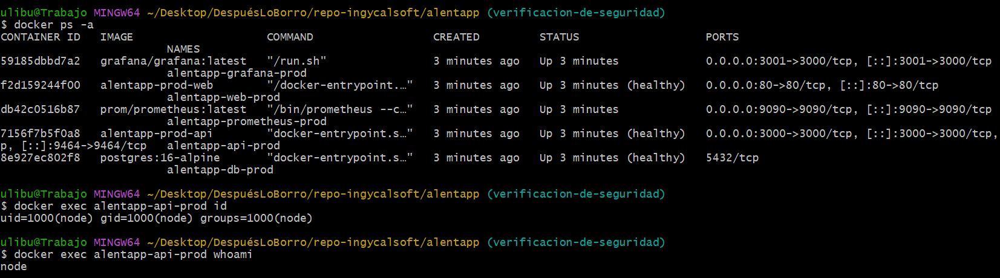

---

### 4.2.2. No hay npm, tsc ni python en la imagen final

**Objetivo:** verificar que la imagen final no incluya herramientas de desarrollo o compilación innecesarias para ejecutar la aplicación en producción.

**Comandos ejecutados:**

```bash
docker exec alentapp-api-prod sh -c "which npm || true; which npx || true; which tsc || true; which python || true; which python3 || true"
docker exec alentapp-web-prod sh -c "which node || true; which npm || true; which tsc || true; which python || true"
```

**Resultado esperado:**

- En `api`, no deberian aparecer rutas para `npm`, `npx`, `tsc`, `python` ni `python3`.
- En `web`, no deberian aparecer rutas para `node`, `npm`, `tsc` ni `python`, porque el runtime final es Nginx.
- Si algun comando devuelve una ruta, se debe registrar como hallazgo y revisar la imagen final.


**Evidencia fotografica:**  

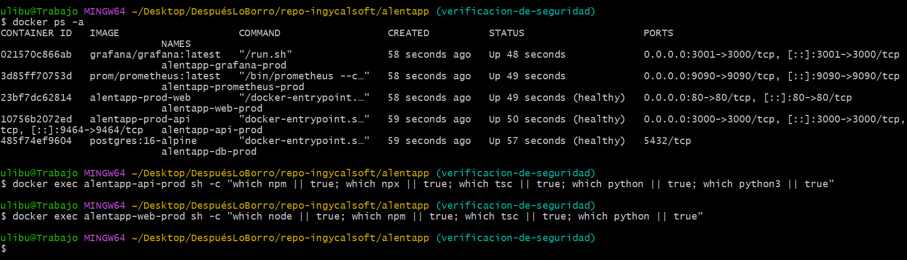

---

### 4.2.3. Filesystem read-only activo

**Objetivo:** confirmar que los contenedores productivos no permiten escritura en la raiz del filesystem.

**Comandos ejecutados:**

```bash
docker exec alentapp-api-prod touch /test
docker exec alentapp-web-prod touch /test
```

**Resultado esperado:**

- Ambos comandos deben fallar.
- El error esperado puede ser similar a `Read-only file system` o `Permission denied`.
- La escritura transitoria solo debe estar disponible en los directorios declarados como `tmpfs`, por ejemplo `/tmp`.

**Evidencia fotografica:**

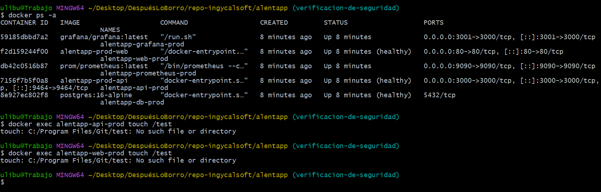

---

### 4.2.4. Capabilities minimas

**Objetivo:** validar que los contenedores no tengan capacidades Linux innecesarias para operaciones privilegiadas.

**Comandos ejecutados:**

```bash
docker exec alentapp-api-prod ping -c 1 8.8.8.8
docker exec alentapp-web-prod ping -c 1 8.8.8.8
docker exec alentapp-api-prod sh -c "mkdir -p /tmp/mnt && mount -t tmpfs tmpfs /tmp/mnt"
docker exec alentapp-web-prod sh -c "mkdir -p /tmp/mnt && mount -t tmpfs tmpfs /tmp/mnt"
```

**Resultado esperado:**

- `ping` debe fallar si no esta disponible o si el contenedor no tiene la capability necesaria.
- `mount` no debe permitir montar nuevos filesystems ni realizar operaciones privilegiadas.
- La configuracion esperada en `docker-compose.prod.yml` es `cap_drop: ALL`, las capabilities estrictamente necesarias en `cap_add` y `sysctls: net.ipv4.ping_group_range: "1 0"`.

**Evidencia fotografica:**  

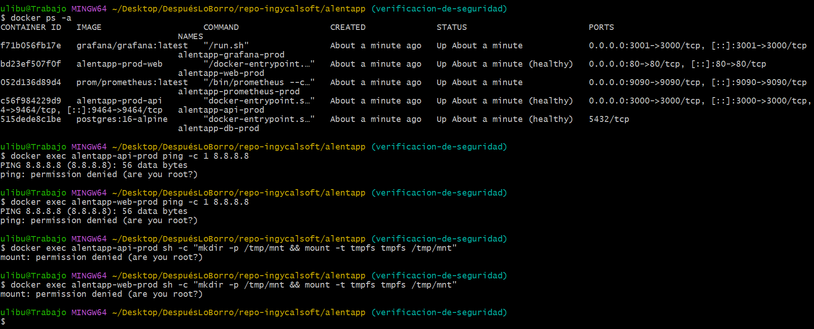

---

### 4.2.5. Variables sensibles via `.env.prod`, no hardcodeadas

**Objetivo:** comprobar que las credenciales y variables sensibles no estan hardcodeadas en la configuracion versionada, sino que se cargan desde `.env.prod`.

**Comandos ejecutados:**

```bash
docker compose -f docker-compose.prod.yml --env-file .env.prod config
git check-ignore .env.prod
```

**Resultado esperado:**

- `docker compose ... config` debe resolver las variables desde `.env.prod`.
- `git check-ignore .env.prod` debe devolver `.env.prod`, confirmando que el archivo no se versiona.
- Las credenciales reales no deben aparecer hardcodeadas en `docker-compose.prod.yml`.

**Evidencia fotografica:**

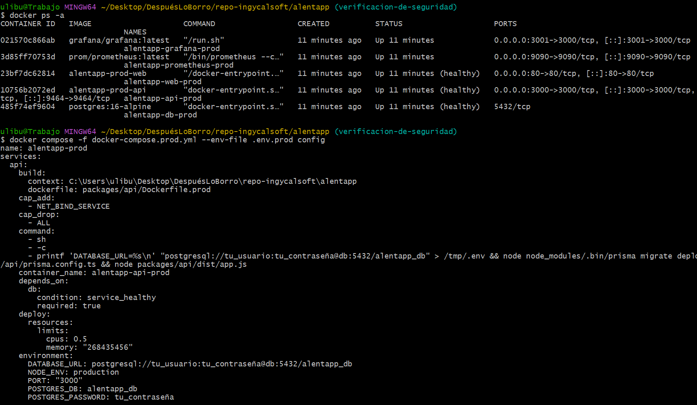

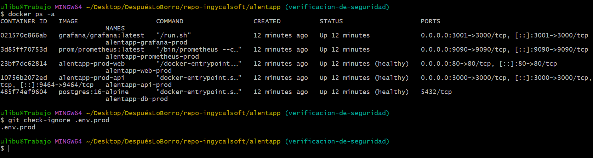

---

### 4.2.6. Healthchecks funcionando

**Objetivo:** confirmar que Docker reporta los servicios principales como saludables.

**Comandos ejecutados:**

```bash
docker ps --format "table {{.Names}}\t{{.Status}}\t{{.Ports}}"
docker inspect --format='{{json .State.Health.Status}}' alentapp-api-prod
docker inspect --format='{{json .State.Health.Status}}' alentapp-web-prod
docker inspect --format='{{json .State.Health.Status}}' alentapp-db-prod
```

**Resultado esperado:**

- `docker ps` debe mostrar `(healthy)` en los servicios con healthcheck.
- Los comandos `docker inspect` deben devolver `"healthy"` para `api`, `web` y `db`.
- Si algun servicio aparece como `starting` o `unhealthy`, esperar el `start_period` configurado y revisar logs si no se recupera.

**Evidencia fotografica:**

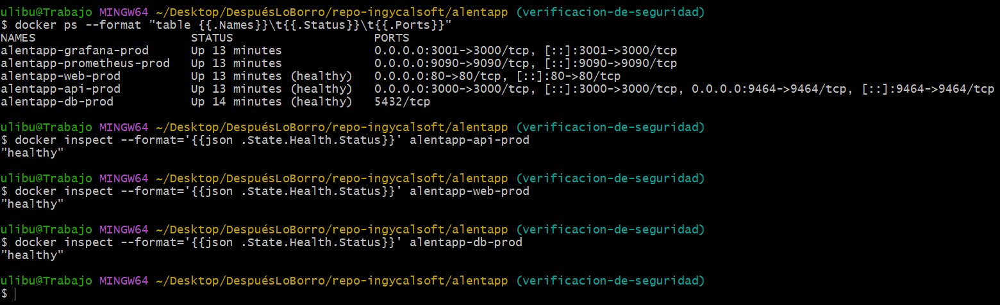

---

## 4.3. Verificación de observabilidad

Esta sección documenta la verificación del stack de observabilidad implementado mediante OpenTelemetry, Prometheus y Grafana. Para ejecutar las pruebas, el stack de producción debe estar levantado con:

```bash
docker compose -f docker-compose.prod.yml up -d
```

---

### OpenTelemetry exporta métricas en :9464/metrics

**Objetivo:** confirmar que OpenTelemetry está correctamente inicializado y expone las métricas RED en el endpoint `/metrics` del puerto `9464`.

**Comando ejecutado:**

```bash
curl http://localhost:9464/metrics | grep -E "http_requests_total|http_request_duration"
```

**Resultado esperado:**

- El endpoint debe responder con métricas en formato Prometheus.
- Deben aparecer las métricas `http_requests_total` con labels `method`, `route` y `status`.
- Deben aparecer las métricas `http_request_duration_bucket`, `http_request_duration_count` y `http_request_duration_sum` con los buckets de latencia.
- La duración se registra mediante reply `elapsedTime` nativo de Fastify, disponible en el hook `onResponse`.

**Evidencia:**

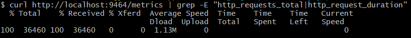

---

### Prometheus scrapea correctamente el endpoint OTLP

**Objetivo:** confirmar que Prometheus está alcanzando el endpoint de métricas del puerto `9464` y recolectando datos correctamente.

**Verificación:**

Se accedió a `http://localhost:9090/targets` para visualizar el estado de los jobs configurados en `observability/prometheus/prometheus.yml`. El job `opentelemetry` apunta a `host.docker.internal:9464` y debe aparecer en estado **UP**. El job `alentapp-api` apunta a `host.docker.internal:3000` y aparece en estado de error ya que la API REST no expone un endpoint `/metrics`, siendo el puerto `9464` el único punto válido de scrape para métricas de OpenTelemetry.

**Evidencia:**

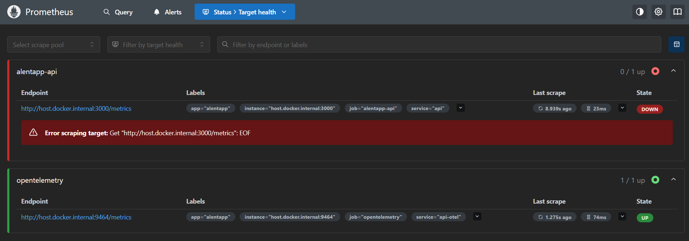

---

### Grafana tiene al menos un datasource Prometheus configurado

**Objetivo:** confirmar que Grafana tiene el datasource de Prometheus correctamente configurado, apuntando al servicio interno `http://prometheus:9090`.

**Verificación:**

El datasource se configura automáticamente al levantar el contenedor de Grafana gracias al archivo `observability/grafana/provisioning/datasources/datasource.yml`. Se accedió a `http://localhost:3001/connections/datasources` para verificar que el datasource **Prometheus** aparece como activo y marcado como predeterminado.

**Evidencia:**

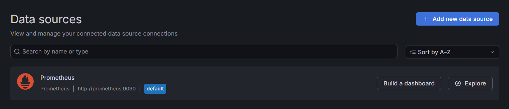

---

### El dashboard RED tiene 6 paneles funcionales y los gráficos responden al tráfico generado

**Objetivo:** confirmar que el dashboard **"RED — Alentapp API"** está disponible en Grafana con los 6 paneles definidos en la Fase 2, y que los gráficos muestran datos reales en respuesta al tráfico generado.

**Verificación:**

El dashboard se carga automáticamente desde `observability/grafana/provisioning/dashboards/red_dashboard.json` mediante provisioning por código. Para generar tráfico y poblar los paneles se ejecutó el siguiente script:

```bash
for i in {1..100}; do
  curl -s http://localhost:3000/api/v1/socios > /dev/null
  curl -s http://localhost:3000/api/v1/sports > /dev/null
  curl -s http://localhost:3000/api/v1/lockers > /dev/null
  sleep 0.05
done
```

Luego de esperar el intervalo de scrape de Prometheus (15 segundos), los paneles comenzaron a mostrar datos. Los 6 paneles funcionales son:

- **Panel 1:** Requests por segundo (Rate)
- **Panel 2:** Tasa de error (4xx/5xx)
- **Panel 3:** Latencia API (p95 / p99)
- **Panel 4:** Por status code
- **Panel 5:** Node.js Memory Usage
- **Panel 6:** Endpoints más lentos (Top 5)

**Evidencia:**

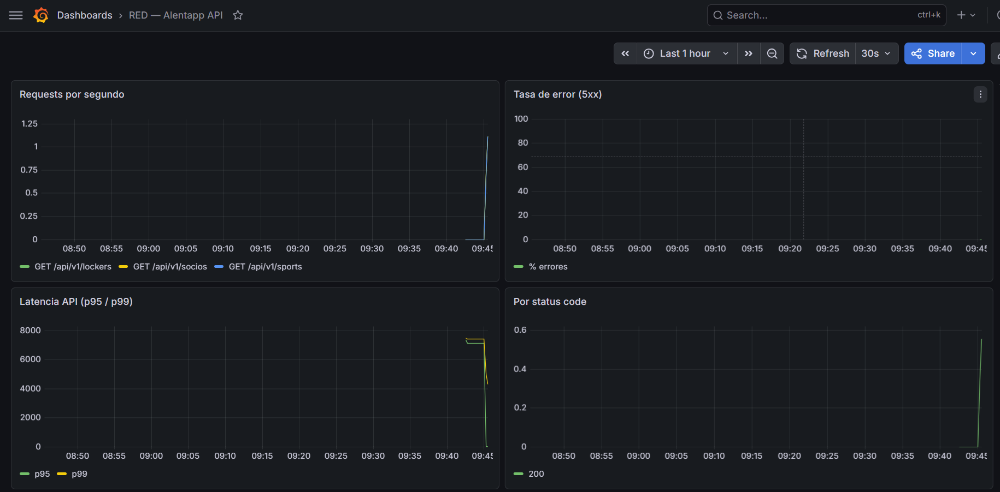

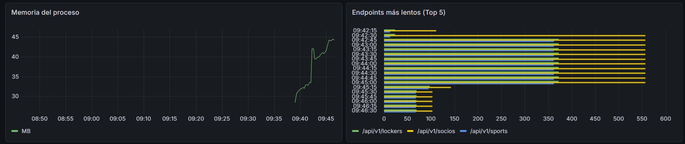

---

### Las métricas de error reflejan los 4xx/5xx

**Objetivo:** confirmar que los errores de cliente (4xx) y de servidor (5xx) se registran correctamente en las métricas y se reflejan en el dashboard.

**Verificación:**

Para generar errores 4xx se ejecutaron requests con datos inválidos y a recursos inexistentes:

```bash
curl -s -X POST http://localhost:3000/api/v1/socios \
  -H "Content-Type: application/json" \
  -d '{"dni": ""}'

curl -s http://localhost:3000/api/v1/socios/dni/00000000
```

Para generar errores 5xx se detuvo temporalmente el servicio de base de datos mientras la API seguía recibiendo requests:

```bash
docker stop alentapp-db-prod
curl -s http://localhost:3000/api/v1/socios
curl -s http://localhost:3000/api/v1/lockers
docker start alentapp-db-prod
```

La lógica de registro de métricas se centralizó en un hook global `onResponse` en `app.ts`, que captura automáticamente el status code real de cada respuesta y lo registra en `requestCounter` y `errorCounter` sin necesidad de instrumentación manual en cada controller. Esto permite que el panel 4 (Por status code) muestre la distribución completa de respuestas y el panel 2 (Tasa de error) refleje los errores como porcentaje del total de requests.

**Evidencia:**

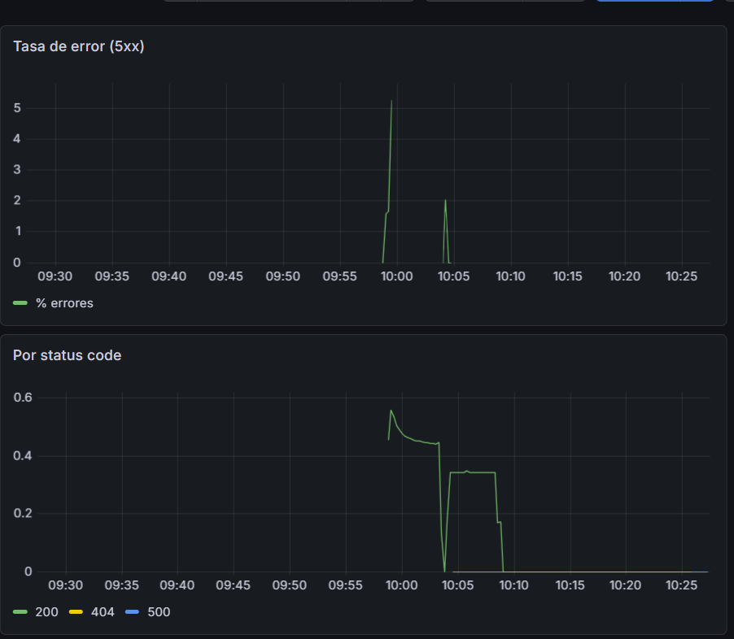