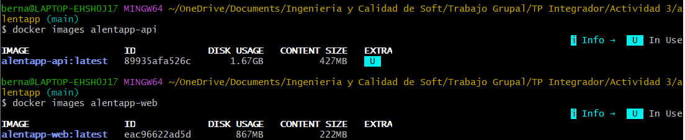
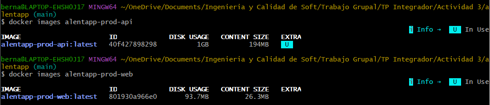
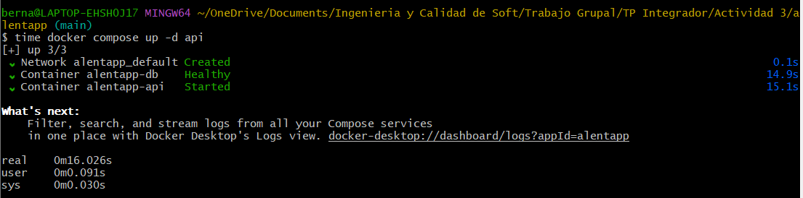
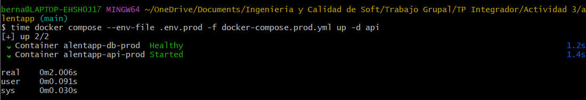
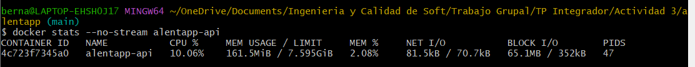
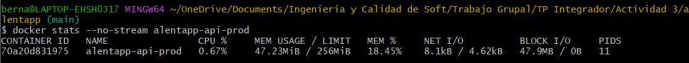
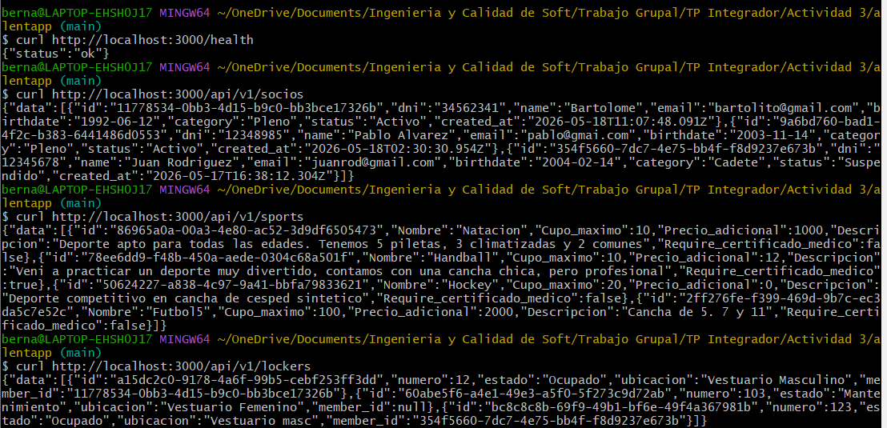
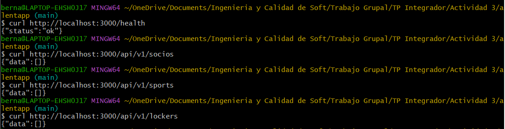
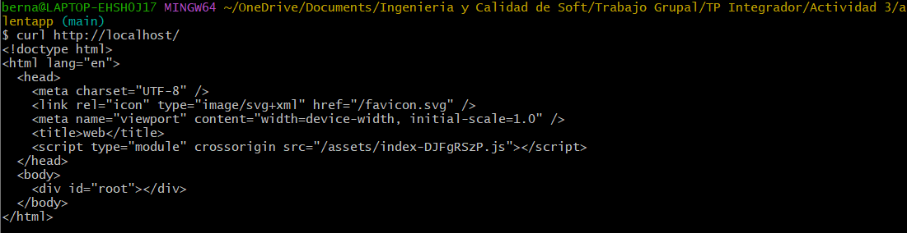

# **Fase 4: Verificar y entregar**

---

## 4.1 Verificación técnica

Para validar la implementación de producción se compararon métricas del entorno de desarrollo con el entorno definido en `docker-compose.prod.yml`. Las verificaciones se realizaron sobre tamaño de imágenes, tiempo de startup de la API, consumo de memoria en reposo, accesibilidad de endpoints y disponibilidad del frontend servido mediante Nginx.

### Comandos utilizados para la verificación

| Métrica               | Antes (desarrollo)                      | Después (producción)                                                            |
| --------------------- | --------------------------------------- | ------------------------------------------------------------------------------- |
| Tamaño imagen API     | `docker images alentapp-api`            | `docker images alentapp-prod-api`                                               |
| Tamaño imagen Web     | `docker images alentapp-web`            | `docker images alentapp-prod-web`                                               |
| Tiempo de startup API | `time docker compose up -d api`         | `time docker compose --env-file .env.prod -f docker-compose.prod.yml up -d api` |
| Memoria API idle      | `docker stats --no-stream alentapp-api` | `docker stats --no-stream alentapp-api-prod`                                    |
| Endpoints accesibles  | `curl http://localhost:3000/api/v1/...` | `curl http://localhost:3000/api/v1/...`                                         |
| Frontend vía Nginx    | No aplica                               | `curl http://localhost/`                                                        |

### Resultados obtenidos

| Métrica               | Antes (desarrollo) | Después (producción) | Mejora                                                      |
| --------------------- | -----------------: | -------------------: | ----------------------------------------------------------- |
| Tamaño imagen API     |             427 MB |               194 MB | Reducción aproximada del 54.6%                              |
| Tamaño imagen Web     |             222 MB |              26.3 MB | Reducción aproximada del 88.2%                              |
| Tiempo de startup API |           16.026 s |              2.006 s | Reducción aproximada del 87.5%                              |
| Memoria API idle      |          161.5 MiB |            47.23 MiB | Reducción aproximada del 70.8%                              |
| Endpoints accesibles | OK: `/health`, `/api/v1/socios`, `/api/v1/sports` y `/api/v1/lockers` responden correctamente | OK: `/health`, `/api/v1/socios`, `/api/v1/sports` y `/api/v1/lockers` responden correctamente | Se mantiene la disponibilidad de la API en producción |
| Frontend vía Nginx | No aplica | OK: `curl http://localhost/` devuelve el HTML del frontend | El frontend se sirve como contenido estático mediante Nginx |

### Verificación de endpoints

Para validar la disponibilidad de la API se probaron los siguientes endpoints:

```bash
curl http://localhost:3000/health
curl http://localhost:3000/api/v1/socios
curl http://localhost:3000/api/v1/sports
curl http://localhost:3000/api/v1/lockers
```

En desarrollo, los endpoints respondieron correctamente. En producción, los endpoints también respondieron correctamente luego de levantar los servicios mediante `docker-compose.prod.yml`. En algunos casos, los endpoints devolvieron `data: []`, lo cual indica que la API respondió correctamente aunque la base de datos productiva local no tuviera registros cargados.

Además, se verificó el acceso al frontend servido por Nginx mediante:

```bash
curl http://localhost/
```

El comando devolvió el HTML principal del frontend, incluyendo la referencia al bundle generado por Vite. Esto confirma que Nginx está sirviendo correctamente la aplicación estática.

### Evidencias de la verificación técnica

A continuación se incluyen las capturas utilizadas como evidencia de las mediciones realizadas.

#### Tamaño de imágenes en desarrollo



#### Tamaño de imágenes en producción



#### Tiempo de startup de la API en desarrollo



#### Tiempo de startup de la API en producción



#### Memoria idle de la API en desarrollo



#### Memoria idle de la API en producción



#### Endpoints accesibles en desarrollo



#### Endpoints accesibles en producción



#### Frontend servido mediante Nginx



### Análisis de resultados

La imagen de la API se redujo de 427 MB a 194 MB, lo que representa una mejora aproximada del 54.6%. Esta reducción se debe al uso de un Dockerfile de producción orientado a runtime, evitando incluir dependencias y herramientas innecesarias en la imagen final.

La imagen del frontend presentó una mejora más significativa, pasando de 222 MB a 26.3 MB, con una reducción aproximada del 88.2%. Esto se logró al separar la etapa de build de Vite de la etapa de ejecución y utilizar Nginx como servidor de archivos estáticos en lugar del servidor de desarrollo.

El tiempo de startup de la API pasó de 16.026 segundos en desarrollo a 2.006 segundos en producción, lo que representa una reducción aproximada del 87.5%. Además, el consumo de memoria idle de la API disminuyó de 161.5 MiB a 47.23 MiB, con una mejora aproximada del 70.8%.

### Conclusión

La verificación técnica permitió comprobar que la configuración de producción ejecuta la aplicación con imágenes específicas para runtime, separando las herramientas de desarrollo del entorno final. Se observó una reducción considerable en el tamaño de las imágenes, una mejora en el tiempo de startup de la API y una disminución del consumo de memoria en reposo.

Además, los endpoints principales de la API se mantuvieron accesibles en producción y el frontend quedó correctamente servido mediante Nginx como contenido estático. Por lo tanto, la configuración resultante cumple con los objetivos técnicos de optimización y preparación para producción planteados.

---

## 4.2. Verificación de seguridad

Esta sección documenta la verificación de las medidas de seguridad aplicadas al entorno productivo de Alentapp. Para ejecutar las pruebas, se debe levantar primero el stack de produccion con el archivo `.env.prod` local:

```bash
docker compose -f docker-compose.prod.yml --env-file .env.prod up -d --build
```

Las capturas de pantalla se guardan en `docs/produccion/evidencias/` y se referencian desde este documento con rutas relativas.

### Resumen de controles

| Control | Comando principal | Resultado esperado
| --- | --- | --- |
| API con usuario no-root | `docker exec alentapp-api-prod id` | El usuario no debe ser `root` ni tener UID `0`. | Pendiente de evidencia |
| Imagen final sin herramientas no deseadas | `which npm`, `which tsc`, `which python` | Los comandos no deben devolver rutas disponibles en la imagen final. | Pendiente de evidencia |
| Filesystem read-only | `touch /test` | La escritura debe fallar por sistema de archivos de solo lectura o permisos insuficientes. | Pendiente de evidencia |
| Capabilities minimas | `ping`, `mount` | Las operaciones privilegiadas deben fallar. | Pendiente de evidencia |
| Variables sensibles por `.env.prod` | `docker compose ... config` y `git check-ignore .env.prod` | Las variables se cargan desde `.env.prod` y el archivo queda ignorado por Git. | Pendiente de evidencia |
| Healthchecks funcionando | `docker ps` | Los servicios deben mostrarse como `healthy`. | Pendiente de evidencia |

---

### 4.2.1. La API corre con usuario no-root

**Objetivo:** confirmar que el proceso de la API se ejecuta con un usuario sin privilegios de root dentro del contenedor.

**Comandos ejecutados:**

```bash
docker exec alentapp-api-prod id
docker exec alentapp-api-prod whoami
```

**Resultado esperado:**

- `whoami` debe devolver `node`.
- `id` debe mostrar un UID distinto de `0`.
- No debe aparecer `root` como usuario efectivo.

**Evidencia fotográfica:**


---

### 4.2.2. No hay npm, tsc ni python en la imagen final

**Objetivo:** verificar que la imagen final no incluya herramientas de desarrollo o compilación innecesarias para ejecutar la aplicación en producción.

**Comandos ejecutados:**

```bash
docker exec alentapp-api-prod sh -c "which npm || true; which npx || true; which tsc || true; which python || true; which python3 || true"
docker exec alentapp-web-prod sh -c "which node || true; which npm || true; which tsc || true; which python || true"
```

**Resultado esperado:**

- En `api`, no deberian aparecer rutas para `npm`, `npx`, `tsc`, `python` ni `python3`.
- En `web`, no deberian aparecer rutas para `node`, `npm`, `tsc` ni `python`, porque el runtime final es Nginx.
- Si algun comando devuelve una ruta, se debe registrar como hallazgo y revisar la imagen final.


**Evidencia fotografica:**  


---

### 4.2.3. Filesystem read-only activo

**Objetivo:** confirmar que los contenedores productivos no permiten escritura en la raiz del filesystem.

**Comandos ejecutados:**

```bash
docker exec alentapp-api-prod touch /test
docker exec alentapp-web-prod touch /test
```

**Resultado esperado:**

- Ambos comandos deben fallar.
- El error esperado puede ser similar a `Read-only file system` o `Permission denied`.
- La escritura transitoria solo debe estar disponible en los directorios declarados como `tmpfs`, por ejemplo `/tmp`.

**Evidencia fotografica:**


---

### 4.2.4. Capabilities minimas

**Objetivo:** validar que los contenedores no tengan capacidades Linux innecesarias para operaciones privilegiadas.

**Comandos ejecutados:**

```bash
docker exec alentapp-api-prod ping -c 1 8.8.8.8
docker exec alentapp-web-prod ping -c 1 8.8.8.8
docker exec alentapp-api-prod sh -c "mkdir -p /tmp/mnt && mount -t tmpfs tmpfs /tmp/mnt"
docker exec alentapp-web-prod sh -c "mkdir -p /tmp/mnt && mount -t tmpfs tmpfs /tmp/mnt"
```

**Resultado esperado:**

- `ping` debe fallar si no esta disponible o si el contenedor no tiene la capability necesaria.
- `mount` no debe permitir montar nuevos filesystems ni realizar operaciones privilegiadas.
- La configuracion esperada en `docker-compose.prod.yml` es `cap_drop: ALL`, las capabilities estrictamente necesarias en `cap_add` y `sysctls: net.ipv4.ping_group_range: "1 0"`.

**Evidencia fotografica:**  


---

### 4.2.5. Variables sensibles via `.env.prod`, no hardcodeadas

**Objetivo:** comprobar que las credenciales y variables sensibles no estan hardcodeadas en la configuracion versionada, sino que se cargan desde `.env.prod`.

**Comandos ejecutados:**

```bash
docker compose -f docker-compose.prod.yml --env-file .env.prod config
git check-ignore .env.prod
```

**Resultado esperado:**

- `docker compose ... config` debe resolver las variables desde `.env.prod`.
- `git check-ignore .env.prod` debe devolver `.env.prod`, confirmando que el archivo no se versiona.
- Las credenciales reales no deben aparecer hardcodeadas en `docker-compose.prod.yml`.

**Evidencia fotografica:**


---

### 4.2.6. Healthchecks funcionando

**Objetivo:** confirmar que Docker reporta los servicios principales como saludables.

**Comandos ejecutados:**

```bash
docker ps --format "table {{.Names}}\t{{.Status}}\t{{.Ports}}"
docker inspect --format='{{json .State.Health.Status}}' alentapp-api-prod
docker inspect --format='{{json .State.Health.Status}}' alentapp-web-prod
docker inspect --format='{{json .State.Health.Status}}' alentapp-db-prod
```

**Resultado esperado:**

- `docker ps` debe mostrar `(healthy)` en los servicios con healthcheck.
- Los comandos `docker inspect` deben devolver `"healthy"` para `api`, `web` y `db`.
- Si algun servicio aparece como `starting` o `unhealthy`, esperar el `start_period` configurado y revisar logs si no se recupera.

**Evidencia fotografica:**


---

## 4.3. Verificación de observabilidad

Esta sección documenta la verificación del stack de observabilidad implementado mediante OpenTelemetry, Prometheus y Grafana. Para ejecutar las pruebas, el stack de producción debe estar levantado con:

```bash
docker compose -f docker-compose.prod.yml up -d
```

---

### OpenTelemetry exporta métricas en :9464/metrics

**Objetivo:** confirmar que OpenTelemetry está correctamente inicializado y expone las métricas RED en el endpoint `/metrics` del puerto `9464`.

**Comando ejecutado:**

```bash
curl http://localhost:9464/metrics | grep -E "http_requests_total|http_request_duration"
```

**Resultado esperado:**

- El endpoint debe responder con métricas en formato Prometheus.
- Deben aparecer las métricas `http_requests_total` con labels `method`, `route` y `status`.
- Deben aparecer las métricas `http_request_duration_bucket`, `http_request_duration_count` y `http_request_duration_sum` con los buckets de latencia.
- La duración se registra mediante reply `elapsedTime` nativo de Fastify, disponible en el hook `onResponse`.

**Evidencia:**


---

### Prometheus scrapea correctamente el endpoint OTLP

**Objetivo:** confirmar que Prometheus está alcanzando el endpoint de métricas del puerto `9464` y recolectando datos correctamente.

**Verificación:**

Se accedió a `http://localhost:9090/targets` para visualizar el estado de los jobs configurados en `observability/prometheus/prometheus.yml`. El job `opentelemetry` apunta a `host.docker.internal:9464` y debe aparecer en estado **UP**. El job `alentapp-api` apunta a `host.docker.internal:3000` y aparece en estado de error ya que la API REST no expone un endpoint `/metrics`, siendo el puerto `9464` el único punto válido de scrape para métricas de OpenTelemetry.

**Evidencia:**


---

### Grafana tiene al menos un datasource Prometheus configurado

**Objetivo:** confirmar que Grafana tiene el datasource de Prometheus correctamente configurado, apuntando al servicio interno `http://prometheus:9090`.

**Verificación:**

El datasource se configura automáticamente al levantar el contenedor de Grafana gracias al archivo `observability/grafana/provisioning/datasources/datasource.yml`. Se accedió a `http://localhost:3001/connections/datasources` para verificar que el datasource **Prometheus** aparece como activo y marcado como predeterminado.

**Evidencia:**


---

### El dashboard RED tiene 6 paneles funcionales y los gráficos responden al tráfico generado

**Objetivo:** confirmar que el dashboard **"RED — Alentapp API"** está disponible en Grafana con los 6 paneles definidos en la Fase 2, y que los gráficos muestran datos reales en respuesta al tráfico generado.

**Verificación:**

El dashboard se carga automáticamente desde `observability/grafana/provisioning/dashboards/red_dashboard.json` mediante provisioning por código. Para generar tráfico y poblar los paneles se ejecutó el siguiente script:

```bash
for i in {1..100}; do
  curl -s http://localhost:3000/api/v1/socios > /dev/null
  curl -s http://localhost:3000/api/v1/sports > /dev/null
  curl -s http://localhost:3000/api/v1/lockers > /dev/null
  sleep 0.05
done
```

Luego de esperar el intervalo de scrape de Prometheus (15 segundos), los paneles comenzaron a mostrar datos. Los 6 paneles funcionales son:

- **Panel 1:** Requests por segundo (Rate)
- **Panel 2:** Tasa de error (4xx/5xx)
- **Panel 3:** Latencia API (p95 / p99)
- **Panel 4:** Por status code
- **Panel 5:** Node.js Memory Usage
- **Panel 6:** Endpoints más lentos (Top 5)

**Evidencia:**


---

### Las métricas de error reflejan los 4xx/5xx

**Objetivo:** confirmar que los errores de cliente (4xx) y de servidor (5xx) se registran correctamente en las métricas y se reflejan en el dashboard.

**Verificación:**

Para generar errores 4xx se ejecutaron requests con datos inválidos y a recursos inexistentes:

```bash
curl -s -X POST http://localhost:3000/api/v1/socios \
  -H "Content-Type: application/json" \
  -d '{"dni": ""}'

curl -s http://localhost:3000/api/v1/socios/dni/00000000
```

Para generar errores 5xx se detuvo temporalmente el servicio de base de datos mientras la API seguía recibiendo requests:

```bash
docker stop alentapp-db-prod
curl -s http://localhost:3000/api/v1/socios
curl -s http://localhost:3000/api/v1/lockers
docker start alentapp-db-prod
```

La lógica de registro de métricas se centralizó en un hook global `onResponse` en `app.ts`, que captura automáticamente el status code real de cada respuesta y lo registra en `requestCounter` y `errorCounter` sin necesidad de instrumentación manual en cada controller. Esto permite que el panel 4 (Por status code) muestre la distribución completa de respuestas y el panel 2 (Tasa de error) refleje los errores como porcentaje del total de requests.

**Evidencia:**


# 4.4. Documentación de decisiones

Este documento resume las decisiones de arquitectura, las razones técnicas detrás de cada decisión y los problemas que surgieron durante el camino.

---

## Arquitectura final

El sistema en producción quedó conformado por cinco servicios orquestados mediante `docker-compose.prod.yml`, todos conectados a la red interna `alentapp-net`:


| Servicio     | Imagen / build                 | Puerto (host)        | Rol                                                        |
| ------------ | ------------------------------ | -------------------- | ---------------------------------------------------------- |
| `web`        | `packages/web/Dockerfile.prod` | 80                   | SPA React compilada por Vite, servida por Nginx            |
| `api`        | `packages/api/Dockerfile.prod` | 3000, 9464           | API Fastify + Prisma; métricas OpenTelemetry en `/metrics` |
| `db`         | `postgres:16-alpine`           | *(solo red interna)* | Base de datos PostgreSQL                                   |
| `prometheus` | `prom/prometheus:latest`       | 9090                 | Recolector de métricas                                     |
| `grafana`    | `grafana/grafana:latest`       | 3001                 | Visualización del dashboard RED                            |


**Flujo de tráfico:**

1. El usuario accede al frontend vía Nginx (`http://localhost:80`).
2. El bundle de Vite llama a la API usando `VITE_API_URL` (inyectada en build time).
3. La API consulta PostgreSQL por la red interna (`db:5432`).
4. OpenTelemetry expone métricas en el puerto `9464`; Prometheus las scrapea y Grafana las visualiza.

**Archivos clave de la arquitectura:**

- Orquestación: `docker-compose.prod.yml`
- Variables de entorno: `.env.prod` (a partir de `.env.prod.example`)
- Build API: `packages/api/Dockerfile.prod`
- Build Web: `packages/web/Dockerfile.prod`
- Telemetría: `packages/api/src/infrastructure/telemetry.ts`
- Dashboard RED: `observability/grafana/provisioning/dashboards/red_dashboards.json`
- Config Prometheus: `observability/prometheus/prometheus.yml`

**Comando de despliegue:**

```bash
docker compose -f docker-compose.prod.yml --env-file .env.prod up -d --build
```

---

## Decisiones técnicas

### 1. Multi-stage builds para Docker

**Decisión:** Separar la construcción de la API y el frontend en tres etapas (`deps`, `build`, `runtime`).

**Por qué:**

- **Seguridad:** La imagen final no contiene herramientas de compilación (`tsc`, `npm`, `npx`), reduciendo la superficie de ataque. En runtime se eliminan explícitamente los binarios de npm.
- **Performance y costos:** Se redujo el tamaño de las imágenes (API: 427 MB → 194 MB; Web: 222 MB → 26 MB) y el tiempo de startup de la API (16 s → 2 s), según las mediciones del informe de verificación técnica.
- **Separación de responsabilidades:** El stage `build` genera artefactos; el stage `runtime` solo copia `dist/`, `node_modules` de producción y los archivos de Prisma necesarios para migraciones.

### 2. Nginx para el frontend en lugar de Node.js

**Decisión:** Usar `nginx:stable-alpine` para servir el frontend en lugar de mantener un servidor Node.js corriendo `vite preview` o `npm run dev`.

**Por qué:** Nginx está diseñado para servir archivos estáticos. Consume mucha menos memoria y CPU, maneja mejor las conexiones concurrentes y permitió configurar compresión `gzip`, cabeceras de seguridad, caché de assets con hash y routing SPA (`try_files` → `index.html`) en `packages/web/nginx.conf`.

### 3. OpenTelemetry con Prometheus Exporter (en lugar de cliente nativo de Prometheus)

**Decisión:** Instrumentar la API con el SDK de OpenTelemetry y exportar métricas mediante `PrometheusExporter` en el puerto `9464`, endpoint `/metrics`.

**Por qué:**

- OpenTelemetry es el estándar de la industria y es agnóstico al proveedor. Si en el futuro queremos enviar trazas o métricas a Datadog, Jaeger o New Relic, solo cambiamos el exporter sin tocar la lógica de negocio.
- Las auto-instrumentaciones (`getNodeAutoInstrumentations`) aportan métricas base del runtime Node.js (por ejemplo, memoria heap).
- Las métricas RED se instrumentan manualmente en cada controller (`http.requests.total`, `http.requests.errors`, `http.request.duration`) con labels `method`, `route` y `status`, siguiendo el diseño de `diseno-grupo2.md`.

**Nota sobre nombres en Prometheus:** OpenTelemetry convierte los puntos de los nombres de métricas a guiones bajos al exportar. Por eso en Grafana las queries usan `http_requests_total` y no `http.requests.total`.

### 4. Stack Prometheus + Grafana con provisioning

**Decisión:** Agregar Prometheus y Grafana como servicios adicionales en `docker-compose.prod.yml`, con configuración declarativa (provisioning) para datasource y dashboard.

**Por qué:**

- Prometheus centraliza el scrapeo periódico (cada 15 segundos) y permite consultas PromQL (`rate()`, `histogram_quantile()`).
- Grafana facilita la visualización del método RED sin construir una UI propia.
- El dashboard `RED — Alentapp API` se versiona en JSON (`red_dashboards.json`) y se carga automáticamente al iniciar Grafana, evitando configuración manual repetitiva.

### 5. `prisma migrate deploy` en el arranque de la API

**Decisión:** Ejecutar migraciones pendientes con `prisma migrate deploy` antes de iniciar `node packages/api/dist/app.js`, escribiendo `DATABASE_URL` en `/tmp/.env` para que `prisma.config.ts` la lea.

**Por qué:**

- `prisma migrate dev` (usado en desarrollo) puede generar migraciones nuevas y no es seguro en producción.
- `migrate deploy` solo aplica migraciones SQL ya versionadas en `packages/api/prisma/migrations/`.
- El directorio `/tmp` es un `tmpfs` escribible, compatible con `read_only: true` del contenedor.

### 6. Hardening de seguridad en Docker Compose

**Decisión:** Aplicar `read_only: true`, `no-new-privileges:true`, `cap_drop: ALL`, `tmpfs` para directorios temporales y correr la API con el usuario `node` (no-root).

**Por qué:**

- Si un atacante explota una vulnerabilidad en la API, el filesystem de solo lectura impide escribir malware en el contenedor.
- `no-new-privileges` evita escalada de privilegios vía `setuid`/`setgid`.
- Dropear capabilities y dejar solo `NET_BIND_SERVICE` (y las mínimas de Nginx: `CHOWN`, `SETUID`, `SETGID`) limita lo que el kernel permite al proceso.
- Los healthchecks, límites de CPU/memoria y rotación de logs (`json-file`, 10 MB × 3 archivos) completan la postura operativa de producción.

### 7. Separación de perfiles: desarrollo vs producción

**Decisión:** Mantener `docker-compose.yml` para desarrollo (bind mounts, hot-reload, `tsx watch`) y `docker-compose.prod.yml` para producción (imágenes inmutables, sin montaje de código fuente).

**Por qué:** Mezclar ambos entornos en un solo archivo complica el mantenimiento y aumenta el riesgo de desplegar accidentalmente configuración de desarrollo en producción.

---

## Problemas encontrados

### 1. Imposibilidad de correr desarrollo y producción en simultáneo

Uno de los primeros obstáculos operativos fue que **no podíamos levantar el entorno de desarrollo y el de producción al mismo tiempo** para comparar comportamiento, revisar imágenes o validar el dashboard de Grafana mientras seguíamos desarrollando.

Al inicio, ambos stacks compartían el mismo *project name* implícito de Docker Compose (derivado del nombre de la carpeta del proyecto). Eso hacía que contenedores, redes y volúmenes de un entorno **pisaran o reemplazaran** los del otro: al hacer `docker compose up` con `docker-compose.prod.yml`, se detenían o conflictuaban recursos que el `docker-compose.yml` de desarrollo ya tenía en uso, y viceversa. En la práctica, levantar producción podía tumbar `alentapp-api` mientras estábamos probando cosas, lo que dificultaba mucho validar la infraestructura nueva sin perder el entorno con el que veníamos trabajando.

Además, varios servicios competían por los **mismos puertos del host** (`3000` para la API, `80` para el frontend, `5432` para PostgreSQL), y los `container_name` fijos (`alentapp-api` vs `alentapp-api-prod`) no alcanzaban para aislar completamente los stacks si el proyecto de Compose seguía siendo el mismo.

**Cómo lo resolvimos:** asignamos un nombre de proyecto distinto a cada archivo Compose mediante la directiva `name` al inicio de cada docker-compose:

- `docker-compose.yml` → `name: alentapp`
- `docker-compose.prod.yml` → `name: alentapp-prod`

Con eso Docker trata cada stack como un proyecto independiente: imágenes prefijadas (`alentapp-prod-api` vs `alentapp-api`), redes separadas (`alentapp-prod_alentapp-net` vs `alentapp_default`), volúmenes distintos y contenedores que ya no se borran mutuamente. Aun así, los puertos publicados siguen siendo un recurso exclusivo del host, por lo que para comparar ambos entornos en la misma máquina hubo que **bajar uno antes de levantar el otro**, o aceptar que solo uno podía estar activo en `localhost:3000` / `localhost:80` a la vez. Pese a esa limitación de puertos, el aislamiento por `name` fue lo que nos permitió trabajar con dos configuraciones sin que Docker destruya recursos del otro stack al hacer `down` o `up`.

### 2. Poco tiempo para un trabajo de infraestructura completo

El plazo para esta entrega fue de **aproximadamente cinco días**. Eso condicionó fuertemente cómo pudimos abordar el trabajo.

No partíamos de cero en cuanto a aplicación: el código funcional en modo desarrollo ya existía (API con Fastify y Prisma, frontend con React/Vite, tests, `docker-compose.yml` con hot-reload). Lo que faltaba fue transformar ese stack orientado a desarrollo en una infraestructura de producción y observabilidad:

- Dockerfiles multi-stage (`Dockerfile.prod` para API y Web)
- `docker-compose.prod.yml` con hardening, healthchecks y límites de recursos
- Separación de variables sensibles en `.env.prod`
- Instrumentación OpenTelemetry y métricas RED en los controllers
- Stack Prometheus + Grafana con provisioning de datasource y dashboard
- Documentación de decisiones, verificación técnica y evidencias de seguridad

En cinco días nos repartimos el tiempo entre nosotros para diseñar, implementar, probar en distintas máquinas del grupo, corregir errores de configuración y redactar el informe. Eso implicó priorizar lo exigible (stack prod funcional, dashboard RED, buenas prácticas de seguridad documentadas) por sobre retoques o mejoras que hubiéramos querido hacer con más tiempo en la entrega.

### 3. Builds inconsistentes entre integrantes: `build --no-cache api`

Durante las pruebas en las distintas notebooks del grupo, a uno de nosotros el proyecto no le funcionaba aunque el resto ya lo tenía levantado con la misma rama y el mismo `.env.prod`. La API fallaba al arrancar y no se podia probar nada ni verificar si los nuevos cambios rompian o era algun tema de docker o anterior.

Tras varios intentos con `docker compose up --build`, el comando que finalmente lo destrabó fue:

```bash
docker compose -f docker-compose.prod.yml build --no-cache api
```

**Por qué pasaba:** Docker reutiliza capas cacheadas del build anterior. En un monorepo con multi-stage build, un cambio en `package-lock.json`, en el `Dockerfile.prod`, en el stage `deps` o en archivos que se copian tarde en el Dockerfile puede no invalidar todas las capas que deberían reconstruirse. Si una capa de `npm ci` o de compilación queda obsoleta pero Docker la considera vigente, la imagen resultante puede mezclar artefactos viejos con configuración nueva. Eso se notó especialmente cuando distintos integrantes fuimos construyendo la imagen de producción en momentos distintos.

Forzar `--no-cache` obliga a reconstruir todas las etapas desde cero, garantizando que `deps`, `build` y `runtime` reflejen el estado actual del código.

### 4. Panel de memoria en Grafana sin datos por una query incorrecta

Una vez que el dashboard RED mostraba correctamente Rate, Errors y Duration, el panel **"Memoria del proceso"** seguía vacío o con error, aunque el resto de métricas HTTP funcionara.

El problema estaba en la expresión PromQL de la línea 78 de `observability/grafana/provisioning/dashboards/red_dashboards.json`:

```json
"expr": "sum(v8js_memory_heap_used) / 1024 / 1024"
```

Esa query asumía que Prometheus recibía una métrica llamada `v8js_memory_heap_used`. En la práctica, **esa serie no existía** en nuestro endpoint `/metrics` (puerto `9464`), o no se exportaba con ese nombre. El diseño original del proyecto contemplaba una métrica `process.memory.usage` definida en OpenTelemetry, pero el dashboard se armó con un nombre tomado de otra convención (métricas automáticas de runtime V8/Node que no estaban disponibles o se exponían con otro identificador tras la conversión OTel → Prometheus).

Mientras las queries de los paneles RED (`http_requests_total`, `http_request_duration_bucket`, etc.) sí coincidían con lo que exportaba la API, el panel de memoria quedó desalineado: Grafana cargaba el dashboard, Prometheus respondía, pero esa expresión puntual no matcheaba ninguna serie, y el gráfico mostraba "No data" de forma permanente.

**Cómo lo abordamos:** revisar en `http://localhost:9464/metrics` los nombres reales de las métricas de memoria que exportan las auto-instrumentaciones de OpenTelemetry (por ejemplo, series relacionadas con `process` o `v8js` según la versión del SDK) y actualizar la línea 78 del JSON con la expresión que corresponda. Esto implicó entender que no alcanza con definir una métrica en el diseño: hay que validar el nombre efectivo en Prometheus después de la transformación del exporter, porque ahí es donde Grafana hace la consulta.

---

## Capturas de pantalla

Las evidencias se guardan en `docs/produccion/evidencias/`. A continuación se documentan las capturas requeridas por la consigna.

### Dashboard RED funcionando con datos

Demostración de que el dashboard `RED — Alentapp API` en Grafana muestra métricas reales de Rate, Errors y Duration.

**Pasos para reproducir:**

1. Levantar el stack de producción:

   ```bash
   docker compose -f docker-compose.prod.yml --env-file .env.prod up -d --build
   ```

2. Generar tráfico contra la API antes de capturar (por ejemplo, `curl http://localhost:3000/health` y los endpoints `/api/v1/socios`, `/api/v1/sports`, `/api/v1/lockers`).
3. Abrir Grafana en `http://localhost:3001` (usuario: `admin`, contraseña: `admin`).
4. Navegar al dashboard **RED — Alentapp API** y verificar que los paneles muestran datos:
   - Requests por segundo
   - Tasa de error (5xx)
   - Latencia API (p95 / p99)
   - Por status code
   - Memoria del proceso
   - Endpoints más lentos (Top 5)

**Evidencias:**

Paneles RED (Rate, Errors, Duration y status code): requests por segundo, tasa de error 5xx, latencia p95/p99 y distribución por código HTTP.


Paneles de saturación: memoria del proceso y endpoints más lentos (Top 5).


---

## Conclusión

La arquitectura final separa claramente build y runtime, sirve el frontend como estáticos con Nginx, ejecuta la API como proceso Node compilado con migraciones controladas y agrega observabilidad RED mediante OpenTelemetry → Prometheus → Grafana. Las decisiones priorizan seguridad (`read_only`, usuario no-root, capabilities mínimas), eficiencia (imágenes reducidas, startup rápido) y mantenibilidad (provisioning declarativo, perfiles dev/prod separados).

Los problemas más relevantes no fueron solo técnicos del código, sino también de tiempo: el conflicto entre stacks de desarrollo y producción hasta aislar proyectos con `name`, la inconsistencia de builds entre integrantes (resuelta con `build --no-cache api`) y en cinco días para montar la infraestructura de producción con observabilidad incluida (utilizando nuevas herramientas para nosotros).